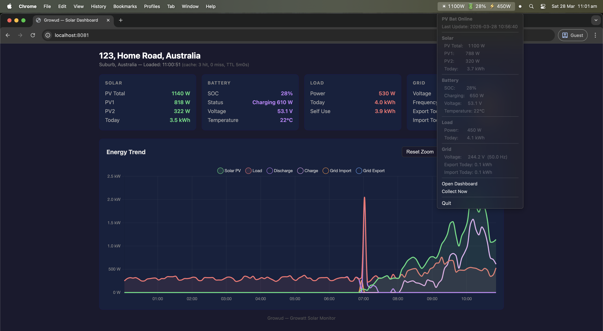

# Growud



A monitoring and data collection tool for **Growatt** hybrid solar inverters. Provides a CLI, web dashboard, and native macOS menu bar app for tracking solar generation, battery state, load consumption, and grid interaction.

## Supported Devices

- **SPH/MIX** (Type 5) - Hybrid inverters
- **MIN/TLX** (Type 7) - Compact hybrid inverters

## Features

- **Real-time summary** of all plants and devices (solar power, battery SOC, load, grid metrics, temperatures)
- **Historical data collection** with SQLite storage and raw JSON archival
- **Interactive terminal charts** with pan/zoom controls
- **Web dashboard** with live metrics and Chart.js visualizations
- **macOS menu bar app** with status indicator and embedded web server
- **Grid cost/credit calculation** with time-of-use tariff support
- **File-based API cache** to minimize Growatt API calls

## Requirements

- Go 1.25.1+
- A [Growatt OpenAPI](https://openapi.growatt.com/) token
- macOS for the menu bar app (`.app` bundle)

## Quick Start

```bash
# Build
make build

# Option 1: Set your token via environment variable
export GROWATT_TOKEN=your_token_here
./growud

# Option 2: Launch the tray app — it will prompt and save to macOS Keychain
./growud tray
```

## Usage

```bash
# Show real-time status of all plants/devices (default command)
./growud

# Collect historical data for a specific date
./growud collect -date 2026-03-28

# Collect a date range (automatically chunked into 7-day API windows)
./growud collect -from 2026-03-01 -to 2026-03-28

# Interactive terminal chart
./growud chart -date 2026-03-28 -device YOUR_DEVICE_SN

# Calculate grid cost for today (requires tariff.json)
./growud cost

# Calculate cost for a specific date
./growud cost -date 2026-03-28

# Calculate cost for a date range
./growud cost -from 2026-03-01 -to 2026-03-28

# Specify device and tariff config path
./growud cost -date 2026-03-28 -device YOUR_DEVICE_SN -tariff /path/to/tariff.json

# Start the web dashboard (localhost only by default)
./growud serve -port 8080

# Listen on all interfaces
./growud serve -bind 0.0.0.0

# Launch macOS menu bar app
./growud tray -port 8080 -refresh 5
```

### Chart Controls

| Key | Action |
|-----|--------|
| `h` / `l` | Pan left / right |
| `+` / `-` | Zoom in / out |
| `0` | Reset view |
| `q` | Quit |

## Configuration

### API Token

The Growatt API token is resolved in this order:

1. **Environment variable** `GROWATT_TOKEN` (including via `.env` file) — useful for CI/scripts
2. **macOS Keychain** — the tray app saves here automatically on first launch

### Environment Variables

Non-secret configuration is loaded from environment variables, which can be set in a `.env` file in the working directory.

| Variable | Description | Default |
|----------|-------------|---------|
| `GROWATT_TOKEN` | API token override (takes precedence over keychain) | |
| `GROWATT_BASE_URL` | Growatt API endpoint | `https://openapi-au.growatt.com/v1/` |
| `GROWATT_VERBOSE` | Enable verbose output | `0` |
| `GROWUD_BIND` | Address to bind the web server to | `127.0.0.1` |
| `GROWUD_PORT` | Web dashboard port | `8080` |
| `GROWUD_REFRESH` | Refresh interval (minutes) | `5` |

### Tariff Configuration

To enable grid cost/credit calculations, create a `tariff.json` file. When running as a CLI, place it in the working directory. When running as a macOS `.app` bundle, place it at `~/Library/Application Support/Growud/tariff.json`.

```json
{
  "timezone": "Australia/Sydney",
  "currency": "AUD",
  "import": [
    {
      "name": "peak",
      "cents_per_kwh": 45.0,
      "from": "14:00",
      "to": "20:00",
      "days": ["mon", "tue", "wed", "thu", "fri"]
    },
    {
      "name": "off_peak",
      "cents_per_kwh": 18.0,
      "from": "00:00",
      "to": "00:00"
    }
  ],
  "export": [
    {
      "name": "feed_in",
      "cents_per_kwh": 5.0,
      "from": "00:00",
      "to": "00:00"
    }
  ]
}
```

**Time windows:**
- `from` and `to` use `HH:MM` format (24-hour)
- `"00:00"` to `"00:00"` means all day
- Overnight windows are supported (e.g. `"22:00"` to `"07:00"`)
- `days` accepts `"mon"` through `"sun"`, `"all"`, or omit for all days

Windows are matched in order — place more specific windows (e.g. peak) before catch-all windows (e.g. off-peak).

### Path Resolution

When running as a **CLI**, data files are stored relative to the working directory (`.env`, `.cache/`, `growud.db`).

When running as a **macOS .app bundle**, standard macOS directories are used:

| Type | Path |
|------|------|
| Data | `~/Library/Application Support/Growud/` |
| Cache | `~/Library/Caches/Growud/` |
| Logs | `~/Library/Logs/Growud/` |

## Web Dashboard API

| Endpoint | Description |
|----------|-------------|
| `GET /` | HTML dashboard |
| `GET /api/summary` | JSON plant/device summary with current values |
| `GET /api/readings?date=YYYY-MM-DD&device=SN` | Historical readings for charting |
| `GET /api/cost?from=YYYY-MM-DD&to=YYYY-MM-DD&device=SN` | Grid import cost and export credit (requires `tariff.json`) |

## Building

```bash
make help       # Show available targets
make test       # Run tests
make build      # Build CLI binary -> growud
make build-app  # Build macOS .app bundle -> Growud.app/
make install    # Install .app to /Applications
make clean      # Remove build artifacts
```

## License

[MIT](LICENSE)
