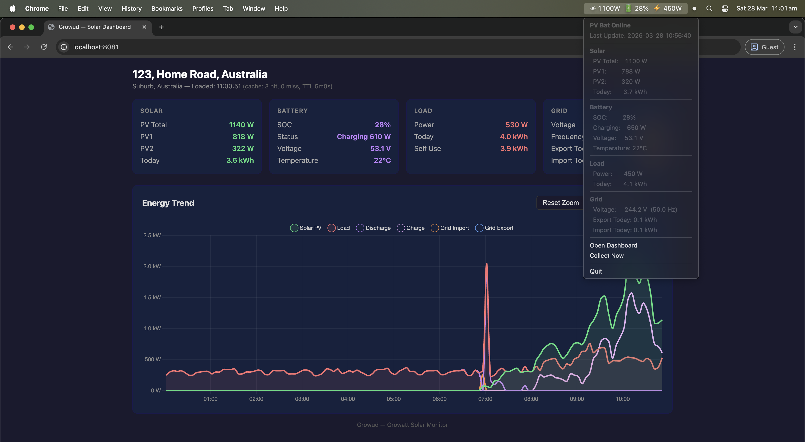

# Growud



A monitoring and data collection tool for **Growatt** hybrid solar inverters. Provides a CLI, web dashboard, and native macOS menu bar app for tracking solar generation, battery state, load consumption, and grid interaction.

## Supported Devices

- **SPH/MIX** (Type 5) - Hybrid inverters
- **MIN/TLX** (Type 7) - Compact hybrid inverters

## Features

- **Real-time summary** of all plants and devices (solar power, battery SOC, load, grid metrics, temperatures)
- **Historical data collection** with SQLite storage and raw JSON archival
- **Interactive terminal charts** with pan/zoom controls
- **Web dashboard** with live metrics and Chart.js visualizations
- **macOS menu bar app** with status indicator and embedded web server
- **Grid cost/credit calculation** with time-of-use tariff support
- **Conditional push notifications** to ntfy.sh or any webhook, with sun-aware rules
- **File-based API cache** to minimize Growatt API calls

## Requirements

- Go 1.25.1+
- A [Growatt OpenAPI](https://openapi.growatt.com/) token
- macOS for the menu bar app (`.app` bundle)

## Quick Start

```bash
# Build
make build

# Option 1: Set your token via environment variable
export GROWATT_TOKEN=your_token_here
./growud

# Option 2: Launch the tray app — it will prompt and save to macOS Keychain
./growud tray
```

## Usage

```bash
# Show real-time status of all plants/devices (default command)
./growud

# Collect historical data for a specific date
./growud collect -date 2026-03-28

# Collect a date range (automatically chunked into 7-day API windows)
./growud collect -from 2026-03-01 -to 2026-03-28

# Interactive terminal chart
./growud chart -date 2026-03-28 -device YOUR_DEVICE_SN

# Calculate grid cost for today (requires tariff.json)
./growud cost

# Calculate cost for a specific date
./growud cost -date 2026-03-28

# Calculate cost for a date range
./growud cost -from 2026-03-01 -to 2026-03-28

# Specify device and tariff config path
./growud cost -date 2026-03-28 -device YOUR_DEVICE_SN -tariff /path/to/tariff.json

# Check notification rules against live data (dry run — sends nothing)
./growud notify

# Send a test notification to every configured target
./growud notify -test

# Start the web dashboard (localhost only by default)
./growud serve -port 8080

# Listen on all interfaces
./growud serve -bind 0.0.0.0

# Evaluate notification rules every 15 minutes while serving
./growud serve -refresh 15

# Launch macOS menu bar app
./growud tray -port 8080 -refresh 5
```

### Chart Controls

| Key | Action |
|-----|--------|
| `h` / `l` | Pan left / right |
| `+` / `-` | Zoom in / out |
| `0` | Reset view |
| `q` | Quit |

## Configuration

### API Token

The Growatt API token is resolved in this order:

1. **Environment variable** `GROWATT_TOKEN` (including via `.env` file) — useful for CI/scripts
2. **macOS Keychain** — the tray app saves here automatically on first launch

### Environment Variables

Non-secret configuration is loaded from environment variables, which can be set in a `.env` file in the working directory.

| Variable | Description | Default |
|----------|-------------|---------|
| `GROWATT_TOKEN` | API token override (takes precedence over keychain) | |
| `GROWATT_BASE_URL` | Growatt API endpoint | `https://openapi-au.growatt.com/v1/` |
| `GROWATT_VERBOSE` | Enable verbose output | `0` |
| `GROWUD_BIND` | Address to bind the web server to | `127.0.0.1` |
| `GROWUD_PORT` | Web dashboard port | `8080` |
| `GROWUD_REFRESH` | Refresh interval for the tray, and notification interval for `serve` (minutes) | `5` |

### Tariff Configuration

To enable grid cost/credit calculations, create a `tariff.json` file. When running as a CLI, place it in the working directory. When running as a macOS `.app` bundle, place it at `~/Library/Application Support/Growud/tariff.json`.

```json
{
  "timezone": "Australia/Sydney",
  "currency": "AUD",
  "import": [
    {
      "name": "peak",
      "cents_per_kwh": 45.0,
      "from": "14:00",
      "to": "20:00",
      "days": ["mon", "tue", "wed", "thu", "fri"]
    },
    {
      "name": "off_peak",
      "cents_per_kwh": 18.0,
      "from": "00:00",
      "to": "00:00"
    }
  ],
  "export": [
    {
      "name": "feed_in",
      "cents_per_kwh": 5.0,
      "from": "00:00",
      "to": "00:00"
    }
  ]
}
```

**Time windows:**
- `from` and `to` use `HH:MM` format (24-hour)
- `"00:00"` to `"00:00"` means all day
- Overnight windows are supported (e.g. `"22:00"` to `"07:00"`)
- `days` accepts `"mon"` through `"sun"`, `"all"`, or omit for all days

Windows are matched in order — place more specific windows (e.g. peak) before catch-all windows (e.g. off-peak).

### Notification Configuration

Notifications are optional. Create a `notifications.json` file to enable them — same locations as `tariff.json` (working directory for the CLI, `~/Library/Application Support/Growud/` for the `.app` bundle).

Rules are evaluated by both long-running modes:

- **`growud tray`** — on each menu bar refresh, reusing data it has already fetched, so notifications cost no extra API calls.
- **`growud serve`** — on a background ticker, set with `-refresh` (default 5 minutes). Better suited to a machine that stays awake.

Both are driven by the same `notify_state.json`, so a rule that has already fired in one process will not fire again in the other. If you run both at once, keep them on different ports — and note that two processes evaluating a minute apart can still each notify if a rule becomes true in the gap between their ticks. Running one or the other avoids the question entirely.

Start from [`notifications.example.json`](notifications.example.json):

```json
{
  "timezone": "Australia/Perth",
  "location": { "latitude": -31.9523, "longitude": 115.8613 },
  "targets": [
    {
      "name": "phone",
      "type": "ntfy",
      "url": "https://ntfy.sh/growud-CHANGE-ME-TO-SOMETHING-UNGUESSABLE",
      "auth_token_env": "NTFY_TOKEN",
      "priority": "default",
      "tags": ["sun_with_face"],
      "click": "http://localhost:8080"
    }
  ],
  "rules": [
    {
      "name": "ev_charge_window",
      "title": "Good time to charge the EV",
      "message": "Battery at {{battery_soc}}% and still making {{solar_power}}W, with {{hours_until_sunset}}h of sun left (sunset {{sunset}}). Plug the car in.",
      "when": {
        "all": [
          { "metric": "battery_soc", "op": ">=", "value": 95 },
          { "metric": "minutes_until_sunset", "op": ">=", "value": 150 },
          { "metric": "solar_power", "op": ">", "value": 2000 }
        ]
      },
      "only_between": { "from": "08:00", "to": "18:00" },
      "cooldown_minutes": 180,
      "priority": "high",
      "tags": ["car", "sunny"],
      "targets": ["phone"]
    }
  ]
}
```

A public ntfy.sh topic is readable by anyone who guesses its name, so pick something long and random — or self-host and set `auth_token_env`.

#### Targets

| Field | Description |
|-------|-------------|
| `name` | Referenced by a rule's `targets` list |
| `type` | `ntfy` or `webhook` |
| `url` | Full topic URL (`https://ntfy.sh/my-topic`) or webhook endpoint |
| `auth_token_env` | Name of an environment variable holding a bearer token — the token itself is never stored in the config file |
| `priority` | ntfy priority: `min`, `low`, `default`, `high`, `urgent` (or `1`-`5`) |
| `tags` | ntfy tags/emoji shortcodes |
| `click` | URL opened when the ntfy notification is tapped |
| `method` | Webhook HTTP method (default `POST`) |
| `headers` | Extra headers to send |
| `body_template` | Webhook body; omit for a JSON payload with the rule, message and all metrics |

An `ntfy` target sends the message as the request body, with the title, priority and tags as headers. A `webhook` target with no `body_template` posts JSON:

```json
{
  "rule": "ev_charge_window",
  "title": "Good time to charge the EV",
  "message": "Battery at 96% ...",
  "device": "ABC1234567",
  "time": "2026-08-25T14:32:00+08:00",
  "metrics": { "battery_soc": 96, "solar_power": 4200, "...": 0 }
}
```

#### Rules

| Field | Description |
|-------|-------------|
| `name` | Unique identifier, also the default title |
| `enabled` | Set to `false` to keep a rule around without evaluating it |
| `title` | Notification title; supports placeholders |
| `message` | Notification body; supports placeholders |
| `when` | The condition — see below |
| `only_between` | Restrict to a time of day and set of days, e.g. `{"from": "08:00", "to": "18:00", "days": ["mon","tue"]}` |
| `cooldown_minutes` | Minimum gap between two notifications from this rule |
| `repeat` | When `true`, fire on every refresh the condition holds (subject to the cooldown) instead of only when it first becomes true |
| `targets` | Which targets to notify; omit to use all of them |
| `priority`, `tags` | Override the target's ntfy defaults |

By default a rule is **edge-triggered**: it notifies when its condition becomes true and stays quiet until the condition has gone false again. That is usually what you want — a battery sitting at 96% all afternoon should ping you once, not every five minutes. Combine with `cooldown_minutes` to throttle a condition that flickers around its threshold.

Firing history is kept in `notify_state.json` alongside the config, so cooldowns survive a restart.

#### Conditions

A condition is either a comparison — `{"metric": ..., "op": ..., "value": ...}` — or one of the combinators `all`, `any`, `not` wrapping further conditions. Operators are `>`, `>=`, `<`, `<=`, `==`, `!=`. They nest:

```json
"when": {
  "all": [
    { "metric": "battery_soc", "op": ">=", "value": 95 },
    { "any": [
      { "metric": "solar_power", "op": ">", "value": 3000 },
      { "metric": "sun_elevation", "op": ">", "value": 30 }
    ]},
    { "not": { "metric": "weekday", "op": "==", "value": 0 } }
  ]
}
```

#### Metrics

Device metrics come from the same live data the dashboard shows:

| Metric | Unit |
|--------|------|
| `battery_soc` | % |
| `battery_charge_power`, `battery_discharge_power` | W |
| `battery_power` | W — net, positive discharging, negative charging |
| `battery_voltage`, `battery_temp`, `battery_soh` | V, °C, % |
| `solar_power`, `solar_power_pv1`, `solar_power_pv2` | W |
| `solar_today_kwh` | kWh |
| `load_power`, `load_today_kwh`, `self_use_today_kwh` | W, kWh |
| `grid_import_power`, `grid_export_power` | W |
| `grid_import_today_kwh`, `grid_export_today_kwh` | kWh |
| `grid_voltage`, `grid_frequency`, `inverter_temp` | V, Hz, °C |

Sun and clock metrics are computed from `location` and `timezone`, so "plenty of daylight left" stays correct as the seasons shift:

| Metric | Unit |
|--------|------|
| `sun_elevation` | degrees above the horizon, negative at night |
| `sun_azimuth` | degrees clockwise from true north |
| `minutes_until_sunset`, `hours_until_sunset` | minutes/hours, 0 once the sun is down |
| `minutes_since_sunrise`, `day_length_minutes` | minutes |
| `hour` | 0-23.99 local, e.g. `14.5` for 14:30 |
| `minute_of_day` | 0-1439 local |
| `weekday` | 0 = Sunday through 6 = Saturday |

Any metric can also be used as a `{{placeholder}}` in a title or message, along with `{{rule}}`, `{{device}}`, `{{time}}`, `{{date}}`, `{{sunrise}}` and `{{sunset}}`. Unknown metrics and placeholders are rejected when the config loads, so a typo shows up immediately rather than as a rule that silently never fires.

#### Testing your rules

`growud notify` evaluates every rule against live data and prints the result without sending anything or touching the firing history:

```
Device: ABC1234567 at 2026-08-25 11:21 (sunrise 06:42, sunset 17:55)

  Metrics
    battery_soc                     96.00
    minutes_until_sunset           393.57
    solar_power                   4200.00
    ...

  Rules (dry run — nothing is sent)
    [WOULD NOTIFY] ev_charge_window
      when:    (battery_soc >= 95 AND minutes_until_sunset >= 150 AND solar_power > 2000)
      title:   Good time to charge the EV
      message: Battery at 96% and still making 4200W, with 6.6h of sun left (sunset 17:55). Plug the car in.
      targets: phone (ntfy)
```

`growud notify -test` sends a fixed test message to every target, to check a topic URL or token. The tray app has a **Test Notifications** menu item that does the same.

A rule that fails to deliver is not recorded as notified, so the next evaluation retries rather than dropping the alert. Delivery failures are logged by whichever process is evaluating.

### Path Resolution

When running as a **CLI**, data files are stored relative to the working directory (`.env`, `.cache/`, `growud.db`, `tariff.json`, `notifications.json`, `notify_state.json`).

When running as a **macOS .app bundle**, standard macOS directories are used:

| Type | Path |
|------|------|
| Data | `~/Library/Application Support/Growud/` |
| Cache | `~/Library/Caches/Growud/` |
| Logs | `~/Library/Logs/Growud/` |

## Web Dashboard API

| Endpoint | Description |
|----------|-------------|
| `GET /` | HTML dashboard |
| `GET /api/summary` | JSON plant/device summary with current values |
| `GET /api/readings?date=YYYY-MM-DD&device=SN` | Historical readings for charting |
| `GET /api/cost?from=YYYY-MM-DD&to=YYYY-MM-DD&device=SN` | Grid import cost and export credit (requires `tariff.json`) |

## Building

```bash
make help       # Show available targets
make test       # Run tests
make build      # Build CLI binary -> growud
make build-app  # Build macOS .app bundle -> Growud.app/
make install    # Install .app to /Applications
make clean      # Remove build artifacts
```

## License

[MIT](LICENSE)
